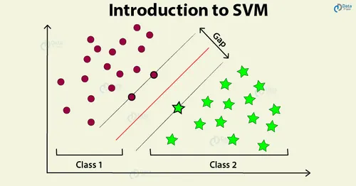

# Linear SVM — Simple and Clear Explanation

## 1. What is Linear SVM?

**Linear Support Vector Machine (SVM)** is a supervised machine learning algorithm used for **classification** (can also be adapted for regression).

Core idea:
> Find the **best line (hyperplane)** that separates classes with the **largest margin**.

---

## 2. Linear SVM Intuition

- Imagine two classes in 2D space
- Many lines can separate them
- **SVM chooses the line that maximizes the distance to the nearest points of both classes**  
- These nearest points are called **support vectors**

---

## 3. Hyperplane Equation

For a linear SVM:

w • x + b = 0

Where:
- **w** → weight vector (direction of the hyperplane)  
- **x** → feature vector  
- **b** → bias (offset of the hyperplane)

**Decision rule:**
- w • x + b ≥ 0 → Class 1  
- w • x + b < 0 → Class 0

---

## 4. Margin and Support Vectors

- **Margin:** Distance between the hyperplane and nearest points  
- SVM **maximizes the margin**  
- Support vectors lie **on the edges of the margin**

---

## 5. Visualization

**Image description:**  
- Two classes (different colors)  
- Hyperplane separating them  
- Two black lines showing margins  
- Points touching margins are **support vectors**

---

## 6. Hard Margin vs Soft Margin

- **Hard Margin SVM:**  
  - Perfect separation, no misclassification allowed  
  - Works only if data is linearly separable

- **Soft Margin SVM:**  
  - Allows some misclassification  
  - Introduces **regularization parameter (C)**  
  - Balances **margin size vs. classification error**

---

## 7. SVM Cost Function (Readable Form)

SVM tries to **minimize**:

Cost = (1/2) × ||w||² + C × sum(max(0, 1 − y × (w • x + b)))

Where:
- **||w||²** → makes the margin large (smaller w → larger margin)  
- **C** → penalty for misclassification  
- **y × (w • x + b)** → ensures correct classification  
- **max(0, …)** → hinge loss (only penalizes wrong or margin-violating points)

---

## 8. Hinge Loss Visualization

**Image description:**  
- X-axis → margin (y × (w • x + b))  
- Y-axis → loss  
- Zero loss when correctly classified and outside margin  
- Linear increase for points inside or misclassified

---

## 9. Training Linear SVM

Steps:
1. Choose regularization parameter C  
2. Initialize w and b  
3. Minimize hinge loss + regularization (often using gradient descent or specialized solvers)  
4. Support vectors determine the hyperplane

---

## 10. Prediction

For a new point x:

1. Compute decision value: d = w • x + b  
2. Predict class:  
   - d ≥ 0 → Class 1  
   - d < 0 → Class 0

---

## 11. Advantages

- Effective for **high-dimensional data**  
- Can handle linearly separable and almost separable cases (soft margin)  
- Works well when the margin between classes is large

---

## 12. Disadvantages

- Sensitive to **feature scaling**  
- Hard to choose C parameter optimally  
- Slow for very large datasets (solvers exist but cost grows)  
- Not naturally probabilistic (probabilities require extra calibration)

---

## 13. Feature Scaling is Important

SVM is sensitive to feature magnitude:
- Standardize features to mean=0, std=1
- Ensures correct margin calculation

---

## 14. Key Takeaways

- Linear SVM finds the **hyperplane with maximum margin**  
- Support vectors are **critical points** that define the hyperplane  
- Soft margin allows tolerance for misclassification  
- Hinge loss + regularization is used for training

---

## 15. One-Line Summary

**Linear SVM separates classes by the hyperplane with the largest margin, determined by support vectors and optimized using hinge loss.**
