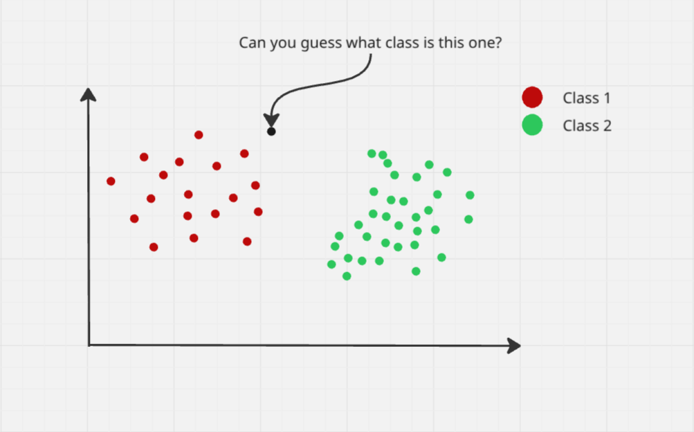

# k-Nearest Neighbors (kNN) — Simple and Clear Explanation

## 1. What is k-Nearest Neighbors?

**k-Nearest Neighbors (kNN)** is a **simple, non-parametric, instance-based algorithm** used for:
- Classification
- Regression

It makes predictions based on **the closest data points** in the feature space.

---

## 2. Core Idea (Intuition)

Imagine you want to classify a new data point:
- Look at the **k closest points** in the training data
- The new point **takes the majority class** among its neighbors

For regression:
- Take the **average value** of the neighbors

---

## 3. How “Closeness” is Measured

Distance is key in kNN. Common metrics:

**Euclidean Distance (most common)**  
Distance between two points x and y:

distance = sqrt( (x1−y1)² + (x2−y2)² + ... + (xn−yn)² )

**Other options:**
- Manhattan Distance: sum of absolute differences
- Minkowski Distance: generalization of Euclidean and Manhattan

---

## 4. kNN Classification Example

- k = 3  
- A new point is near three neighbors:  
  - 2 points → class A  
  - 1 point → class B  

Prediction: **Class A** (majority vote)

---

## 5. Visualization

**Image description:**  
- 2D scatter plot  
- Two classes of points (different colors)  
- New data point shown  
- Lines connecting to k nearest neighbors  
- Majority class highlighted as predicted class

---

## 6. Choosing k (Number of Neighbors)

- **Small k** → sensitive to noise, overfitting  
- **Large k** → smooths decision boundary, may underfit  

**Rule of thumb:**  
k = sqrt(number of training points) (experiment to find the best)

---

## 7. Algorithm Step-by-Step

1. Choose k (number of neighbors)  
2. Compute distance from new point to all training points  
3. Select k points with smallest distance  
4. For classification: take **majority class**  
5. For regression: take **average value**  
6. Return the prediction

---

## 8. kNN Regression Example

- k = 3  
- New point neighbors have values: 4, 5, 6  
- Predicted value = (4 + 5 + 6) / 3 = 5

---

## 9. Advantages of kNN

- Simple and intuitive  
- No training step (instance-based)  
- Works for classification and regression  
- Can handle multi-class problems easily

---

## 10. Disadvantages

- Slow for large datasets (computes distances to all points)  
- Sensitive to irrelevant features (requires feature scaling)  
- Choice of k can affect performance significantly  

---

## 11. Key Takeaways

- kNN predicts using nearby points in feature space  
- Distance metric and k value are crucial  
- Lazy learner → no explicit model  
- Intuitive and easy to implement

---

## 12. One-Line Summary

**k-Nearest Neighbors predicts the class or value of a new point based on the majority or average of its k closest neighbors.**
