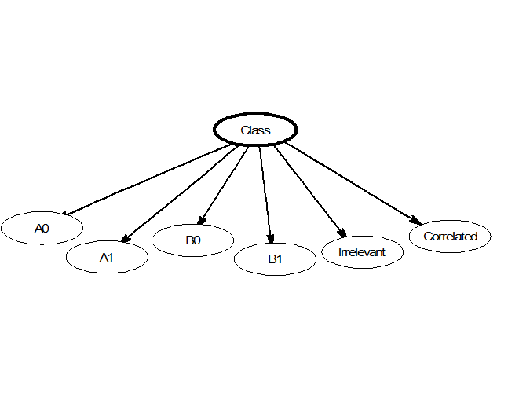

# Naive Bayes — Simple and Clear Explanation

## 1. What is Naive Bayes?

**Naive Bayes** is a supervised machine learning algorithm used mainly for **classification**.

It is based on **Bayes’ Theorem** and works especially well for:
- Text classification (spam detection)
- Sentiment analysis
- Document categorization

It is called **“naive”** because it assumes features are independent.

---

## 2. Core Idea (Intuition)

To classify a new data point:
- Look at how likely each class is
- Choose the class with the **highest probability**

In simple terms:
> “Given these features, which class is most probable?”

---

## 3. Bayes’ Theorem (Readable Form)

Bayes’ Theorem:

P(Class | Features) =  
P(Features | Class) × P(Class) / P(Features)

Where:
- P(Class | Features) → probability of the class given the features
- P(Features | Class) → likelihood
- P(Class) → prior probability
- P(Features) → evidence (same for all classes, often ignored)

---

## 4. Why Is It Called “Naive”?

Naive Bayes assumes:
- Each feature is **independent** of the others

Example:
- Word “free” in an email is independent of word “win”

This assumption is often false, but surprisingly the model still works well.

---

## 5. Classification Rule

For each class:
- Compute the probability using Bayes’ Theorem
- Pick the class with the **highest probability**

---

## 6. Naive Bayes Visualization

**Image description:**  
- A class node at the top  
- Multiple feature nodes connected below  
- Arrows showing independent feature contributions to the class probability

---

## 7. Types of Naive Bayes

### 1. Gaussian Naive Bayes
Used when features are **continuous** and normally distributed.

Example:
- Height
- Weight

---

### 2. Multinomial Naive Bayes
Used for **discrete counts**.

Example:
- Word counts in documents

---

### 3. Bernoulli Naive Bayes
Used for **binary features**.

Example:
- Word appears or not (0 or 1)

---

## 8. Example: Spam Detection

Given an email with words:
- “free”
- “win”
- “money”

The model computes:
- Probability of spam
- Probability of not spam

Whichever is higher becomes the prediction.

---

## 9. Training Naive Bayes

Training involves:
- Calculating class probabilities
- Calculating feature probabilities per class

There is **no gradient descent** and no iterative optimization.

---

## 10. Why Naive Bayes Is Fast

- Very few computations
- No complex optimization
- Works well on high-dimensional data

That’s why it’s popular in NLP tasks.

---

## 11. Advantages

- Extremely fast
- Works well with large datasets
- Handles high-dimensional data
- Simple and interpretable

---

## 12. Disadvantages

- Strong independence assumption
- Poor performance when features are highly correlated
- Zero probability problem (handled with smoothing)

---

## 13. Zero Probability Problem

If a feature never appears in a class:
- Probability becomes zero
- Entire class probability becomes zero

### Solution:
**Laplace Smoothing**
- Adds a small value to all counts

---

## 14. When Should You Use Naive Bayes?

Use Naive Bayes when:
- Data is text-based
- Features are mostly independent
- Speed is important

---

## 15. Key Takeaways

- Naive Bayes is a probabilistic classifier
- Based on Bayes’ Theorem
- Makes a strong independence assumption
- Very fast and effective for text classification

---

## 16. One-Line Summary

**Naive Bayes classifies data by choosing the class with the highest probability using Bayes’ Theorem and feature independence.**
