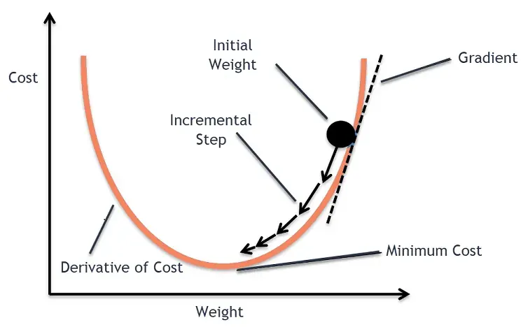
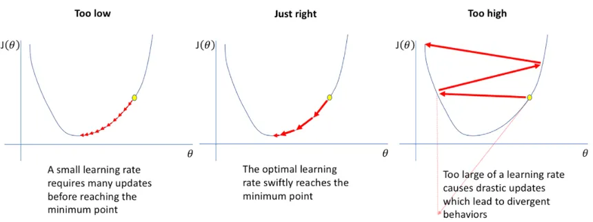
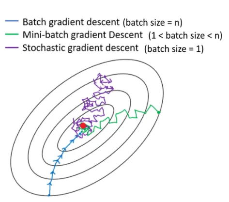

# Gradient Descent — Simple and Visual Explanation

## 1. What is Gradient Descent?

**Gradient Descent** is an optimization algorithm used to **minimize a cost (loss) function**.

In Machine Learning, we use it to:
- Reduce prediction error
- Find the best model parameters (weights)

In simple words:
> Gradient Descent adjusts model parameters step by step until the error is as small as possible.

---

## 2. The Core Idea (Intuition)

Imagine you are standing on a mountain and want to reach the **lowest point** (the valley):

- You look at the slope around you
- You take a small step downhill
- You repeat until you can’t go any lower

That’s exactly how Gradient Descent works.

---

## 3. Why Do We Need Gradient Descent?

For models like **Linear Regression**, we define an error function:

Mean Squared Error (MSE):

MSE = (1 / n) × sum of (actual y − predicted y)²

Our goal:
- Find parameter values that **minimize MSE**
- But checking all possible values is impossible
- Gradient Descent gives us an efficient solution

---

## 4. Gradient Descent Visualization

**Image description:**  
A 2D curve representing the cost function:
- x-axis → model parameter (e.g. m)
- y-axis → cost (error)
- The lowest point represents the minimum error

---

## 5. How Gradient Descent Works (Step-by-Step)

1. Start with random parameter values
2. Compute the error (cost)
3. Calculate the slope (gradient)
4. Move parameters in the opposite direction of the slope
5. Repeat until convergence

---

## 6. Update Rule (Readable Equation)

For a parameter `w`:

w = w − (learning_rate × gradient)

Where:
- **w** → model parameter
- **learning_rate** → step size
- **gradient** → direction and speed of increase of the error

---

## 7. Learning Rate (Very Important!)

The **learning rate** controls how big each step is.

### Too Small:
- Training is very slow

### Too Large:
- Overshoots the minimum
- May never converge

---

## 8. Learning Rate Visualization

**Image description:**  
Three curves showing:
- Small learning rate → slow convergence
- Optimal learning rate → fast convergence
- Large learning rate → divergence

---

## 9. Gradient Descent for Linear Regression

For linear regression:

y = m x + b

We update:
- **m** (slope)
- **b** (intercept)

Each iteration:
- Compute prediction error
- Update m and b to reduce error

---

## 10. Parameter Update Example

Simplified idea:

- If prediction is too high → decrease parameters
- If prediction is too low → increase parameters

The gradient tells us **how much and in which direction**.

---

## 11. Types of Gradient Descent

### Batch Gradient Descent
- Uses all data points
- Stable but slow

### Stochastic Gradient Descent (SGD)
- Uses one data point at a time
- Faster but noisy

### Mini-Batch Gradient Descent
- Uses small batches of data
- Most commonly used in practice

---

## 12. Types Visualization

**Image description:**  
Three paths toward the minimum:
- Smooth path (Batch)
- Zigzag path (SGD)
- Balanced path (Mini-batch)

---

## 13. When Does Gradient Descent Stop?

Gradient Descent stops when:
- Error stops decreasing
- Gradient becomes very small
- Maximum number of iterations is reached

---

## 14. Common Problems

### Local Minima
- Algorithm may stop at a non-global minimum

### Slow Convergence
- Poor learning rate choice

### Feature Scaling Issues
- Unscaled data slows convergence

---

## 15. Key Takeaways

- Gradient Descent minimizes the cost function
- It moves parameters opposite to the gradient
- Learning rate controls speed and stability
- Used in almost all ML and DL models

---

## 16. One-Line Summary

**Gradient Descent is an iterative algorithm that finds optimal parameters by moving downhill on the error surface.**
