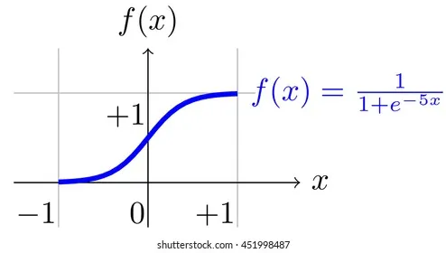

# Logistic Regression — Simple and Clear Explanation

## 1. What is Logistic Regression?

**Logistic Regression** is a supervised machine learning algorithm used for **classification**, not regression.

It predicts:
- One of two classes (Binary Classification)
- Examples:
  - Spam / Not Spam
  - Pass / Fail
  - Yes / No

Despite the name, it is a **classification model**.

---

## 2. Why Not Use Linear Regression for Classification?

Linear Regression outputs any real number:
- Negative values
- Values greater than 1

But for classification, we want:
- A **probability** between 0 and 1

So we use **Logistic Regression**.

---

## 3. The Model Equation

Logistic Regression has two steps:

### Step 1: Linear Combination

z = w x + b

This is the same as linear regression.

---

### Step 2: Sigmoid Function

The output is passed through the **sigmoid function**:

sigmoid(z) = 1 / (1 + e^(−z))

This squashes any number into the range:
- 0 < output < 1

---

## 4. Sigmoid Function Visualization

**Image description:**  
An S-shaped curve:
- x-axis → z (linear output)
- y-axis → probability (0 to 1)
- Values near 0 → class 0
- Values near 1 → class 1

---

## 5. Output Interpretation

The model outputs a **probability**:

Example:
- Output = 0.87 → 87% probability of class 1

### Decision Rule:
- If probability ≥ 0.5 → predict class 1
- If probability < 0.5 → predict class 0

---

## 6. Decision Boundary

Logistic Regression creates a **decision boundary**:

**Image description:**  
A 2D plot with:
- Two classes of data points
- A straight line separating the classes
- Points on one side → class 0
- Points on the other side → class 1

---

## 7. Cost Function (Log Loss)

Mean Squared Error does NOT work well for classification.

Logistic Regression uses **Log Loss** (Binary Cross-Entropy):

Cost = − [ y × log(pred) + (1 − y) × log(1 − pred) ]

Where:
- y → true label (0 or 1)
- pred → predicted probability

---

## 8. Why Log Loss?

- Strongly penalizes confident wrong predictions
- Convex function → easier optimization
- Works well with probabilities

---

## 9. Training Logistic Regression

Training means:
- Find w and b that minimize the cost
- Use **Gradient Descent**

Each iteration:
1. Compute predictions
2. Compute cost
3. Update parameters
4. Repeat

---

## 10. Gradient Descent Update Rule

For each parameter:

w = w − (learning_rate × gradient)

b = b − (learning_rate × gradient)

The gradients are computed from the log loss.

---

## 11. Logistic Regression vs Linear Regression

| Feature | Linear Regression | Logistic Regression |
|------|------------------|-------------------|
| Task | Regression | Classification |
| Output | Any real number | Probability (0–1) |
| Function | Straight line | Sigmoid curve |
| Cost | MSE | Log Loss |

---

## 12. Multiclass Logistic Regression

Logistic Regression can be extended to multiple classes using:
- One-vs-Rest (OvR)
- Softmax Regression

---

## 13. Assumptions

Logistic Regression works best when:
1. Relationship between features and log-odds is linear
2. Little or no multicollinearity
3. Dataset is not extremely complex

---

## 14. Common Problems

- Imbalanced datasets
- Outliers affecting the decision boundary
- Poor feature scaling

---

## 15. Key Takeaways

- Logistic Regression is a classification algorithm
- Uses sigmoid to output probabilities
- Trained using log loss + gradient descent
- Simple, fast, and interpretable

---

## 16. One-Line Summary

**Logistic Regression predicts probabilities for classification using a sigmoid function and log loss optimization.**
